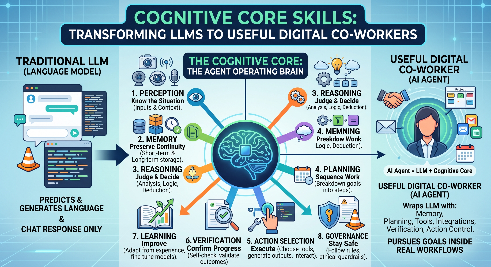

# Cognitive Core Skills



[](.github/workflows/taxonomy-ci.yml)
[](Skills/index.md)
[](LICENSE)
[](.github/workflows/pages-deploy.yml)
[](https://github.com/eli-labz/Cognitive-Core-Skills/stargazers)
[](https://github.com/eli-labz/Cognitive-Core-Skills/network/members)
[](CONTRIBUTING.md)
[](GOOD_FIRST_ISSUE_GUIDE.md)

Cognitive core skills are the mental operating capabilities an LLM or AI Agent needs to move from chat response to useful digital co-worker. An LLM predicts and generates language. An AI Agent wraps that LLM with memory, planning, tools, integrations, verification, and action control so it can pursue goals inside real workflows.

Cognitive core skills are the agent operating brain: perception to know the situation, memory to preserve continuity, reasoning to judge, planning to sequence work, action selection to execute, verification to confirm progress, learning to improve, and governance to stay safe.

## Table of contents

- [Repository overview](#repository-overview)
- [Why star or fork this project](#why-star-or-fork-this-project)
- [Quickstart](#quickstart)
- [Current status](#current-status)
- [Capability model differences](#capability-model-differences)
- [Key package paths](#key-package-paths)
- [Discussions setup guide](#discussions-setup-guide)
- [Recent taxonomy update](#recent-taxonomy-update)
- [Run validation locally](#run-validation-locally)
- [Deploy through GitHub](#deploy-through-github)
- [How to add a new skill](#how-to-add-a-new-skill)
- [Regenerate skill markdown files](#regenerate-skill-markdown-files)
- [Star history](#star-history)
- [Support this project](#support-this-project)
- [Attribution and license boundaries](#attribution-and-license-boundaries)

## Repository overview

This repository contains a universal, industry-neutral taxonomy package for:

- LLM capabilities
- SLM capabilities
- AI agent capabilities
- World model capabilities
- Text-based cognitive skills
- Human-action cognitive skills
- Persistent LLM Wiki knowledge operations
- OKF-style knowledge cataloging operations

## Why star or fork this project

- Practical: ready-to-use taxonomy data, schemas, and validation tests.
- Operational: includes human-action skills and governance-oriented constructs.
- Reusable: JSON, YAML, and markdown skill cards for easy integration.
- Collaborative: contribution templates, roadmap, and CI in place.

## Quickstart

1. Read the taxonomy package docs in `docs/cognitive-core-skills/`.
2. Explore machine-readable data in `data/`.
3. Browse generated skill cards in `Skills/index.md`.
4. Run validation locally.

## Current status

- Taxonomy version: `1.0.0`
- Skill count: `159`
- Domains covered: `13`
- Generated skill files in `Skills/`: `159` skill cards plus `Skills/index.md`
- CI enabled for taxonomy and benchmark fixture tests

## Capability model differences

| System type | Primary strength | Typical limitation without augmentation |
|---|---|---|
| LLM | Broad language understanding, synthesis, reasoning, drafting | Weak continuity and no autonomous bounded action by default |
| SLM | Low-latency, low-cost, private, constrained inference | Narrower transfer and lower open-domain depth |
| AI Agent | Goal pursuit across memory, planning, tools, and actions | Requires robust verification, control gates, and oversight |
| World Model | State and dynamics modeling, simulation, forecasting | Requires grounded observations and updated environment state |

## Key package paths

Documentation:

- `docs/cognitive-core-skills/README.md`
- `docs/cognitive-core-skills/taxonomy.md`
- `docs/cognitive-core-skills/text-based-skills.md`
- `docs/cognitive-core-skills/human-action-skills.md`
- `docs/cognitive-core-skills/world-model-skills.md`
- `docs/cognitive-core-skills/llm-wiki-skills.md`
- `docs/cognitive-core-skills/okf-skills.md`
- `docs/cognitive-core-skills/evaluation-rubric.md`
- `docs/cognitive-core-skills/cognitive-debt-index.md`
- `docs/cognitive-core-skills/glossary.md`
- `docs/cognitive-core-skills/CHANGELOG.md`

Machine-readable artifacts:

- `data/cognitive-core-skills.json`
- `data/cognitive-core-skills.yaml`
- `schemas/cognitive-core-skill.schema.json`
- `schemas/cognitive-core-taxonomy.schema.json`

Benchmarks and examples:

- `benchmarks/rubric-task-traces.json`
- `examples/cognitive-core-skill-card.md`
- `examples/agent-skill-assessment.md`

Generated skills directory:

- `Skills/index.md`
- `Skills/<skill_id>.md` (one file per taxonomy skill)

Tests and CI:

- `tests/test_cognitive_core_taxonomy.py`
- `tests/test_rubric_benchmark_fixtures.py`
- `.github/workflows/taxonomy-ci.yml`

Community and project health:

- `CONTRIBUTING.md`
- `GOOD_FIRST_ISSUE_GUIDE.md`
- `RELEASE_CHECKLIST.md`
- `ROADMAP.md`
- `.github/ISSUE_TEMPLATE/bug_report.yml`
- `.github/ISSUE_TEMPLATE/feature_request.yml`
- `.github/pull_request_template.md`

## Discussions setup guide

If you enable GitHub Discussions for this repository, use this baseline structure to improve community onboarding and retention.

Recommended categories:

- Announcements: release highlights and roadmap updates.
- Q and A: usage questions and troubleshooting.
- Ideas: proposed skills, schema changes, and benchmark additions.
- Show and tell: implementations using this taxonomy.
- Governance: policy, review, and release process topics.

Recommended pinned discussions:

- Welcome and how to contribute.
- How to propose a new skill.
- How to submit benchmark traces.

Moderation and triage suggestions:

- Convert strong Ideas threads into labeled issues.
- Route beginner-friendly threads to good first issues.
- Link resolved questions to docs for reuse.
- Close stale threads with pointers to current docs.

Helpful companion docs:

- `CONTRIBUTING.md`
- `GOOD_FIRST_ISSUE_GUIDE.md`
- `RELEASE_CHECKLIST.md`

## Recent taxonomy update

Added human-action skill:

- `ha_consequence_understanding` - Human-Action Consequence Understanding

Purpose: understand likely downstream operational, compliance, and workflow consequences before executing human-action tokens.

Added planning skill:

- `plan_long_horizon_skill` - Long-Horizon Skill

Purpose: maintain coherent long-horizon execution across milestones, dependencies, and replanning triggers.

## Run validation locally

```powershell
py -m pytest tests/test_cognitive_core_taxonomy.py tests/test_rubric_benchmark_fixtures.py -q
```

## Deploy through GitHub

This repository is now configured for GitHub-native deployment workflows.

- CI workflow: `.github/workflows/taxonomy-ci.yml`
- Pages workflow: `.github/workflows/pages-deploy.yml`
- Docs entry page: `docs/index.md`
- Repository license: `LICENSE`
- Repository ignore rules: `.gitignore`

For GitHub Pages deployment:

1. Push to `main`.
2. In repository settings, enable Pages with source set to GitHub Actions.
3. The `pages-deploy` workflow will publish site content from `docs/`.

## How to add a new skill

1. Add the skill card to `data/cognitive-core-skills.json`.
2. Mirror the same skill in `data/cognitive-core-skills.yaml`.
3. Ensure unique `id` and unique `name`.
4. Add valid `related_skills` references.
5. Regenerate the `Skills/` folder markdown cards from taxonomy data.
6. Update `docs/cognitive-core-skills/CHANGELOG.md` under `Unreleased`.
7. Run the local pytest command above.

## Regenerate skill markdown files

When taxonomy data changes, regenerate skill card markdown files in `Skills/` so they remain synchronized with `data/cognitive-core-skills.json`.

Expected result:

- one markdown file per skill id
- one generated index file at `Skills/index.md`

Run:

```powershell
py scripts/generate_skills.py
```

## Attribution and license boundaries

This taxonomy package adapts high-level architecture/documentation patterns from:

- `third-party/autoresearch-master`
- `third-party/knowledge-catalog-main`
- `third-party/knowledge-catalog-main/okf`

No third-party source code is copied into taxonomy artifacts.

## Star history

If this taxonomy is useful to you, a star helps others discover it and tells us which direction to invest in next.

[](https://star-history.com/#eli-labz/Cognitive-Core-Skills&Date)

## Support this project

- Star the repo to bookmark it and help with discoverability.
- Fork the repo if you want to adapt the taxonomy, schemas, or skill cards for your own agent stack.
- Open an issue for a missing skill, a schema question, or a benchmark idea. See `GOOD_FIRST_ISSUE_GUIDE.md` for beginner-friendly entry points.
- Share a "Show and tell" write-up if you build something on top of this taxonomy once Discussions are enabled.
